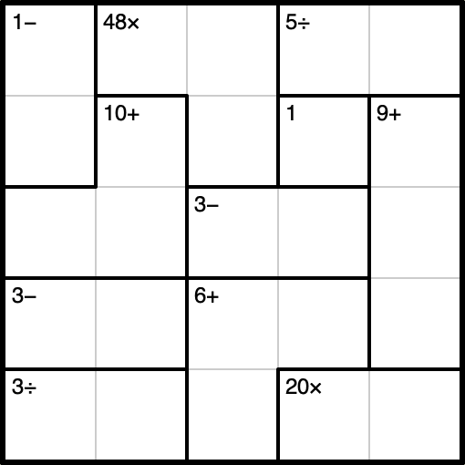

# Kenny

*A KenKen puzzle generator and solver.*

## Features

* Generate KenKen puzzles
* Solve KenKen puzzles
* Robust constraint propagation algorithm to solve most puzzles without backtracking
* Backtracking to solve harder puzzles
* Save SVG images of puzzles
* Save an image at each step of the solution

## Generate a puzzle

    kenny --generate --width 5 --save-all

Run the above command to generate a new, random KenKen puzzle. An image of the puzzle will be saved as well as a text version of the puzzle which may be passed back to kenny for solving the puzzle.

## Solve a puzzle

    kenny --generate --solve --save-all

Use the `--solve` flag to solve the puzzle. This may be used together with the `--generate` flag to generate and solve at once. In the output, you will find an SVG image of the solved puzzle as well as an image for every step of the solution in a folder named "steps".

## More

    kenny --help

Run with `--help` to see more options

## How the solver works

### Defining the Problem

KenKen puzzles are considered a [Constraint Satisfaction Problem](https://en.wikipedia.org/wiki/Constraint_satisfaction_problem) (CSP). To put it in a few words, a CSP has variables, and those variables have domains and constraints. So, we can define a KenKen puzzle in this way:

* The **variables** of a KenKen puzzle are the cells. Each cell must be solved with a number.
* The **domain** of each variable (cell) is, initially, 1-N where N is the width/height of the puzzle. The domain may be written at the bottom of the cell with numbers crossed out or erased as they are eliminated.
* There are two **constraints**:
  1. For every row and column, it must contain all of the numbers in the range 1 to N where N is the width and height of the puzzle (this may be called the [latin square](https://en.wikipedia.org/wiki/Latin_square) constraint).
  2. For every cage, there must exist a permutation of the cells' values where, when the values are joined with the cage operator to form a mathematical expression, the expression is equal to the cage target value.

### Puzzle Markup

While solving a KenKen puzzle, you need to hold information about "what we know so far" about the solution. In Kenny, the puzzle markup contains:

1. Cell variables ("cell domain") - Each cell of the puzzle has an associated variable. A cell variable has two possible states:
   1. Solved - Contains the solved value of the cell
   2. Unsolved - Contains the set of possible values for the cell (domain)
2. Cage solutions variables ("cage solution domain") - Each cage of the puzzle has an associated cage solutions variable. A cage solutions variable is a set of possible solutions for the cage where a cage solution consists of a solution value for each cell in the cage.

*Note: The cage solutions variables here may seem unnecessary – they don't correspond to anything in the problem definition above. In fact, the cage solutions variables are really just the cell variables copied and repackaged. But, keeping a record of the "domain of cage solutions" allows for a much smarter and more efficient constraint propagation algorithm. This separates Kenny from many other KenKen solvers.*

### Constraint Propagation

Kenny uses [constraint propagation](https://en.wikipedia.org/wiki/Local_consistency) as its core strategy for solving KenKen puzzles.

*One way to conceptualize the constraint propagation algorithm is to imagine 8 people standing around a table, working together to solve a KenKen puzzle. Each person only knows one very specific strategy for solving the puzzle. One at a time, they each take a turn to try and contribute a part of the solution. On their turn, if they are able, they will write in a value or cross off a domain value. Otherwise, they will pass to the next person. Each time someone contributes to the solution, they go back to the first person and repeat the process, taking turns again. Each person's strategy is limited, and they can only contribue at certain times in the process. But working together, they can solve most puzzles that a real human could solve. In this metaphor, each person represents one of the implementations of the `Constraint` trait.*

`Constrait` is a Rust trait defined in the code which has 8 implementations (the exact number is not significant). Each `Constraint` enforces a specific logical constraint on the puzzle markup. As the puzzle is solved, it contributes changes to the markup when the markup is proven to be "inconsistent" with the logical constraint being enforced. For instance, if a cell domain value is equal to a cell solution value in the same row, this is inconsistent with the latin square constraint, so the domain value will be removed to "enforce" the constraint.

Here is an outline of the actual `Constraint`'s in Kenny:

1. When a cell is solved, remove the value from other cells in the same vectors (row and column).
1. If one cage solution remains for a cage, solve the cage.
1. If a vector has only one cell with a given value in its domain, solve the cell.
1. If no cage solutions have a value in a cell's domain, remove the cell domain value.
1. If all cage solutions for a cage have a value in a given vector, remove the value from other cells in the vector.
1. If a preemptive set\* exists within a vector, remove the values from other cells in the vector.
1. If, within a vector, a value is known to be in a certain cage, remove cage solutions without the value in the vector.
1. Remove cage solutions that conflict with a cell's entire domain outside of the cage.

\* A preemptive set is a set of cells where the size of the union of their domains is equal to the number of cells. For a simple example: two cells next to each other each have a domain of \[2, 3\]. The term is borrowed from [A Pencil-and-Paper Algorithm for Solving Sudoku Puzzles](https://www.ams.org/notices/200904/tx090400460p.pdf).

### Backtracking

If a solution cannot be found with constraint propagation, then you have a very difficult puzzle! But this is certainly not impossible. These puzzles must be solved using a [backtracking](https://en.wikipedia.org/wiki/Backtracking) search algorithm. The search begins wherever the constraint propagation left off. It "makes a guess" by solving a cell in the puzzle markup, and then passes the markup right back to the constraint propagation algorithm to continue solving with the new "hint". Of course, the guess might prove to be a bad guess, and that's where backtracking comes in.

Backtracking search is particularly useful for detecting puzzles that have multiple solutions. Such puzzles are generally considered to be invalid and are discarded.

## Future Goals?

* Detect puzzle difficulty level
* Support no-op puzzles
* Specify operators to be used in the puzzle
